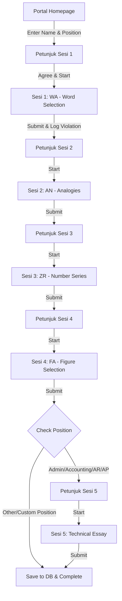

# AI Agent Developer Guide (`AGENTS.md`)

This guide is designed for AI coding agents (like Antigravity) and human developers who want to understand, maintain, test, or extend the **Uji IST Sementara** project. It outlines the system architecture, application flows, database structure, security controls, and specific development instructions.

---

## 📌 Project Overview
**Uji IST Sementara** (Temporary Intelligence Structure Test) is a Laravel-based web application designed for candidate testing. It combines components of standard psychological tests (Intelligenz-Struktur-Test / IST) with position-specific technical essays to evaluate job candidates.

### Core Stack
*   **Backend Framework:** Laravel (PHP)
*   **Database:** MySQL / MariaDB (relational database using Eloquent and Query Builder)
*   **Frontend:** HTML5, CSS3 (Custom Glassmorphic Design System), Bootstrap 5, Vanilla JavaScript
*   **Assets:** Responsive images, custom visual reasoning assets (`public/gambar/visual_reasoning/`)
*   **PWA Integrations:** Progressive Web App support using `public/sw.js` and `public/manifest.json`

---

## 📂 Project Directory Structure

For easy reference, the main development paths are:
*   [UjianController.php](file:///Users/attraqtia/Documents/GitHub/uji-ist-sementara/app/Http/Controllers/UjianController.php) - Manages the candidate flow, randomizes questions, tracks sessions, handles cheat detection counters, and saves responses to the database.
*   [DashboardController.php](file:///Users/attraqtia/Documents/GitHub/uji-ist-sementara/app/Http/Controllers/DashboardController.php) - Handles administrator PIN updates and psychologist reports export.
*   [AuthController.php](file:///Users/attraqtia/Documents/GitHub/uji-ist-sementara/app/Http/Controllers/AuthController.php) - Simple PIN-based authentication logic.
*   [Models Directory](file:///Users/attraqtia/Documents/GitHub/uji-ist-sementara/app/Models) - Contains models for the candidates (`PesertaUji`), session answers (`JawabanSesi2` through `JawabanSesi6`), access control (`AksesPin`), and key tables.
*   [Web Routes](file:///Users/attraqtia/Documents/GitHub/uji-ist-sementara/routes/web.php) - Defines all web entry points and API-like posts.
*   [Blade Views](file:///Users/attraqtia/Documents/GitHub/uji-ist-sementara/resources/views) - Layout templates (`layouts/ujian.blade.php`), candidate interfaces (`ujian/`), and admin dashboard pages (`dashboard/`).

---

## 🔄 Candidate Exam Workflow

The exam flow is sequential and session-based:



### Subtests Breakdown
1.  **Sesi 1 (WA / Wortauswahl):**
    *   Queries `bank_soal_sesi2` using `DB::table()`.
    *   Retrieves 20 random questions.
    *   Shuffles multiple-choice options (`A` to `E`) randomly per candidate.
    *   Stores shuffled question configurations in candidate session state (`soal_sesi2`).
2.  **Sesi 2 (AN / Analogi):**
    *   Retrieves 20 multiple-choice questions from `bank_soal_sesi3` sorted by `id_soal`.
3.  **Sesi 3 (ZR / Zahlenreihen):**
    *   Retrieves 20 multiple-choice questions from `bank_soal_sesi4` sorted by `id_soal`.
4.  **Sesi 4 (FA / Figurenauswahl):**
    *   Visual/spatial reasoning test.
    *   Renders 20 questions mapping to local image assets stored at `public/gambar/visual_reasoning/{1-20}.png`.
5.  **Sesi 5 (Technical Essay & Case Studies):**
    *   Only presented to candidates applying for: `Admin penjualan (SA)`, `ACCOUNTING (A)`, `ACCOUNT RECEIVABLE [AR]`, or `ACCOUNT PAYABLE [AP]`.
    *   Includes 5 structural questions and 4 or 5 complex case studies tailored to the target role.
    *   If a candidate applies for `"Lainnya"` (Other), this session is automatically skipped, and they proceed to the completion page.

---

## 🔒 Security & Anti-Cheat System

The candidate layout ([ujian.blade.php](file:///Users/attraqtia/Documents/GitHub/uji-ist-sementara/resources/views/layouts/ujian.blade.php)) features a robust client-side anti-cheat monitoring system:
*   **Triggers:** Listens to `visibilitychange` (tab switching) and window `blur` (clicking outside the browser frame).
*   **Freeze Penalty:** Upon trigger, locks the UI with a full-screen `#freeze-overlay` for **13 seconds**.
*   **Audio Siren:** Automatically plays a synthesized emergency alarm using the Web Audio API (`AudioContext`).
*   **Logging:** Increments a hidden form field (`pelanggaran_sesi`). On session submission, this value is committed to the candidate's `total_pelanggaran` count in the database.

---

## 🗄️ Database Architecture & Scoring

Unlike standard Laravel projects, the core testing tables do not exist in Laravel migration files. They are managed directly on the database server. Below is a map of the expected schema:

### Candidate Tables
*   `peserta_uji`: Stores participant metadata (`id_peserta`, `nama`, `posisi`, `total_pelanggaran`, `waktu_mulai`).
*   `jawaban_sesi2` to `jawaban_sesi6`: Relate back to `id_peserta` and record the submitted answers (`q1` through `q20`/`q25`).

### Reference & Normalization Tables
*   `bank_soal_sesi2`, `bank_soal_sesi3`, `bank_soal_sesi4`: Question banks.
*   `kunci_jawaban`: Answer key records used to evaluate correct items.
*   `norma_ist_sw`: Standard Score (SW - Standard Wert) converter mapping Raw Scores (number of correct answers) to standardized values.
*   `norma_ist_kategori`: Groups Standard Scores into textual categories (e.g., Average, Above Average, Low).

---

## 📊 Administration & Reports

The psychologist/admin workspace is authenticated via a custom session value `role_akses` derived from a static PIN matched in the `akses_pin` table:
1.  **Psychologist (`psikolog`):** Can search and export all candidate testing results within a date range to an Excel file (`.xls`).
    *   Scores for multiple-choice sessions are computed on-the-fly during export by cross-referencing `kunci_jawaban`.
    *   Standard scores (SW) are resolved using `norma_ist_sw`.
    *   Descriptions are generated using range conditions from `norma_ist_kategori`.
    *   Essay answers (Sesi 5) are included in the spreadsheet to allow manual scoring by the psychologist.
2.  **Administrator (`admin`):** Has privileges to update the psychologist's access PIN.

---

## 🛠️ Developer & Agent Checklist

When making changes to this project, keep the following patterns in mind:

### 1. Database Connections
*   If testing locally, copy `.env.example` to `.env` and set appropriate database configs.
*   Since migrations for the tables `peserta_uji`, `bank_soal_*`, `norma_ist_*` etc. do not exist, ensure you obtain a SQL dump of the schema or mock the tables using raw SQL queries prior to running tests.

### 2. Session Integrity
*   Candidate state is preserved in the PHP session.
*   If adding new subtests or editing question distributions, ensure the session keys are safely cleared inside `UjianController::index` and `UjianController::simpan` to prevent state leakage across different test takers.

### 3. Cheat Counter Handling
*   Any changes to candidate forms must preserve the hidden `<input type="hidden" name="pelanggaran_sesi" id="pelanggaran_sesi" value="0">` element. Removing it will cause JavaScript execution errors or break violation logging.

### 4. Running the Project Locally
To run the server and asset pipeline:
```bash
# Install PHP dependencies
composer install

# Install JS packages
npm install

# Build static assets (Vite)
npm run dev

# Start development server
php artisan serve
```

### 5. Writing and Running Tests
*   Ensure custom controllers are tested for middleware limits (checking if candidate name exists before serving exam sessions).
*   Run backend tests using:
```bash
php artisan test
```
